# 📖 Panduan Pengguna YT-Short-Clipper

Panduan lengkap untuk menggunakan YT-Short-Clipper bagi pemula.

---

## 📑 Daftar Isi

- [1. Download & Instalasi](#1-download--instalasi)
  - [1.1 Download dari GitHub](#11-download-dari-github)
  - [1.2 Extract dan Jalankan](#12-extract-dan-jalankan)
- [2. Setup Library (yt-dlp, FFmpeg & Deno)](#2-setup-library-yt-dlp-ffmpeg--deno)
- [3. Setup Cookies YouTube](#3-setup-cookies-youtube)
  - [3.1 Install Extension Browser](#31-install-extension-browser)
  - [3.2 Export Cookies](#32-export-cookies)
  - [3.3 Upload Cookies ke Aplikasi](#33-upload-cookies-ke-aplikasi)
- [4. Membuat API Key di YT Clip AI (Rekomendasi)](#4-membuat-api-key-di-yt-clip-ai-rekomendasi)
  - [4.1 Login dengan Google](#41-login-dengan-google)
  - [4.2 Top Up Balance](#42-top-up-balance)
  - [4.3 Buat API Key](#43-buat-api-key)
- [5. Konfigurasi AI API](#5-konfigurasi-ai-api)
  - [5.1 Buka AI API Settings](#51-buka-ai-api-settings)
  - [5.2 Pilih Modul AI](#52-pilih-modul-ai)
  - [5.3 Pilih AI Provider](#53-pilih-ai-provider)
  - [5.4 Masukkan API Key & Load Models](#54-masukkan-api-key--load-models)
  - [5.5 Validasi & Simpan](#55-validasi--simpan)
- [6. Mulai Menggunakan Aplikasi](#6-mulai-menggunakan-aplikasi)

---

## 1. Download & Instalasi

### 1.1 Download dari GitHub

1. Buka halaman GitHub YT-Short-Clipper
2. Klik menu **"Releases"** di sidebar kanan

   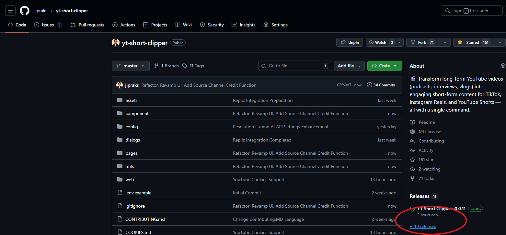

3. Pada halaman Releases, cari file dengan ekstensi `.exe` dan klik untuk download

   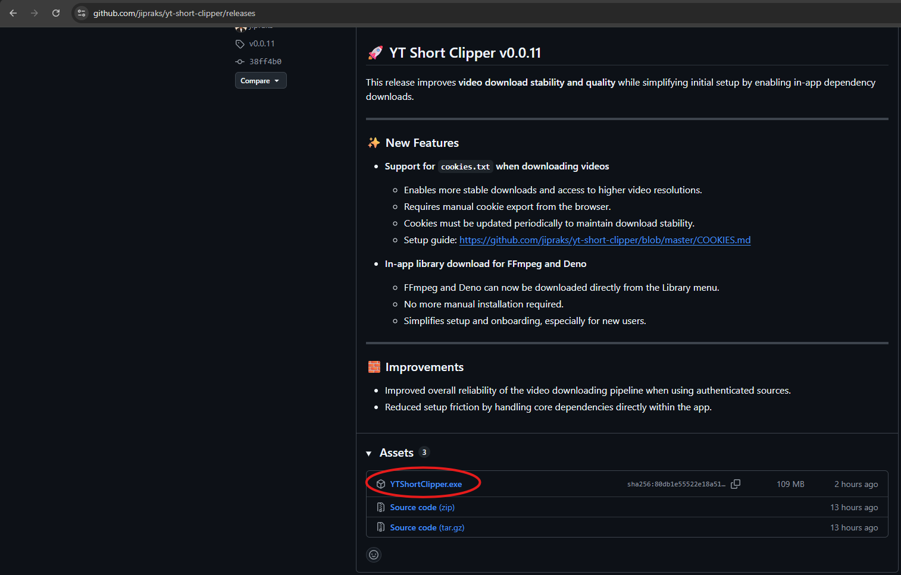

### 1.2 Jalankan Aplikasi

1. Setelah download selesai, double-click file `.exe` untuk menjalankan aplikasi
2. Jika muncul peringatan Windows Defender, klik **"More info"** → **"Run anyway"**

---

## 2. Setup Library (yt-dlp, FFmpeg & Deno)

Aplikasi membutuhkan library tambahan untuk download dan proses video.

1. Saat pertama kali membuka aplikasi, klik tombol **"Library"** di pojok kanan atas

   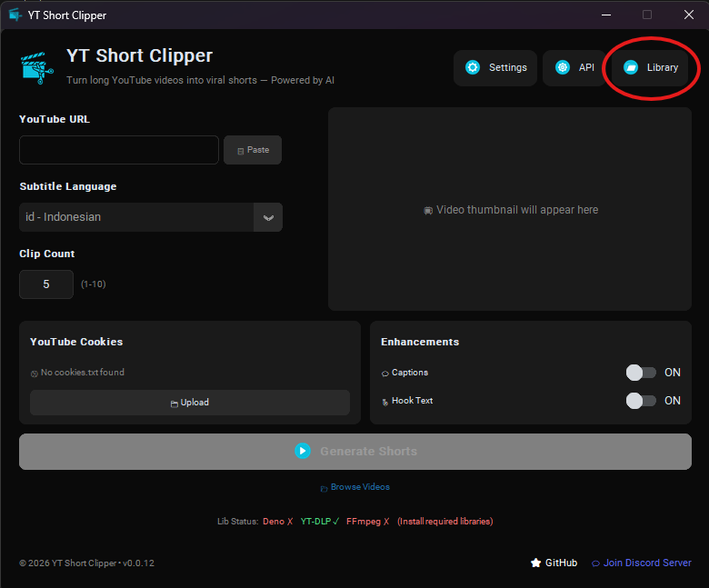

2. Klik tombol **"Download"** untuk mengunduh library yang diperlukan

   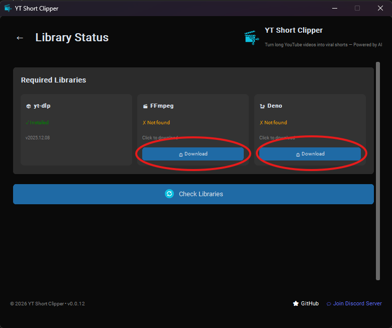

3. Tunggu proses download selesai

   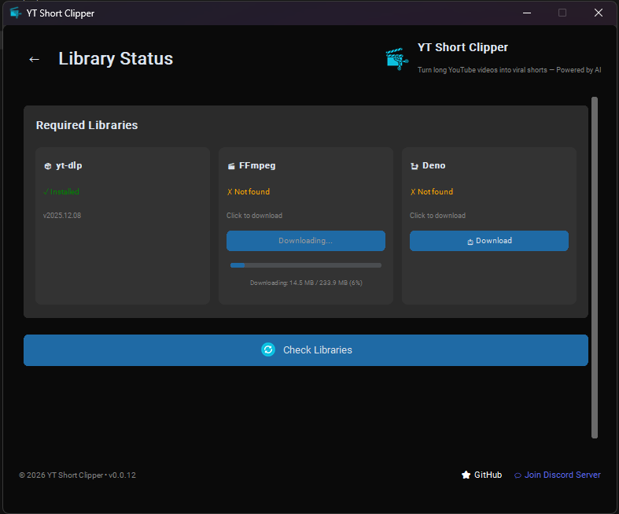

4. Setelah selesai, status akan berubah menjadi ✅ **Installed**
5. **Restart aplikasi** setelah semua library terinstall

---

## 3. Setup Cookies YouTube

Cookies diperlukan agar aplikasi bisa mengakses video YouTube atas nama kamu.

### 3.1 Install Extension Browser

1. Buka browser Chrome/Edge
2. Install extension **"Get cookies.txt LOCALLY"**:
   - [Download untuk Chrome/Edge](https://chromewebstore.google.com/detail/get-cookiestxt-locally/cclelndahbckbenkjhflpdbgdldlbecc)

### 3.2 Export Cookies

1. Buka [youtube.com](https://youtube.com) dan **pastikan sudah login**
2. Klik icon extension di toolbar browser

   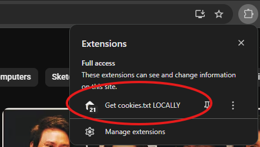

3. Klik **"Export"** untuk menyimpan cookies

   

4. Simpan file sebagai `cookies.txt`

### 3.3 Upload Cookies ke Aplikasi

1. Di halaman utama aplikasi, klik tombol **"Upload Cookies"**

   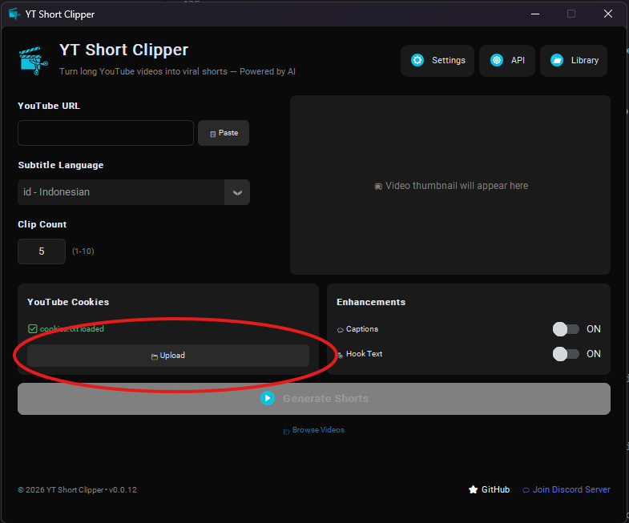

2. Pilih file `cookies.txt` yang sudah di-export
3. Status cookies akan berubah menjadi ✅ **Valid**

> **⚠️ Penting:** 
> - Cookies YouTube biasanya expired dalam 1-2 minggu
> - Jika muncul error autentikasi, export ulang cookies dari browser
> - Jangan pernah share file cookies.txt ke orang lain

---

## 4. Membuat API Key di YT Clip AI (Rekomendasi)

**YT Clip AI** adalah AI provider yang direkomendasikan karena harga lebih terjangkau dan sudah dioptimasi untuk aplikasi ini.

### 4.1 Login dengan Google

1. Buka [https://ai.ytclip.org](https://ai.ytclip.org)
2. Klik **"Login with Google"** dan pilih akun Google kamu

   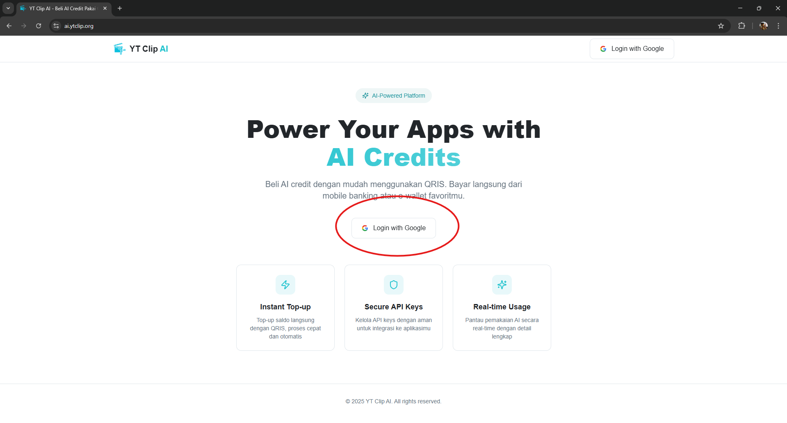

### 4.2 Top Up Balance

1. Setelah login, klik tombol **"Top Up"** untuk menambah saldo

   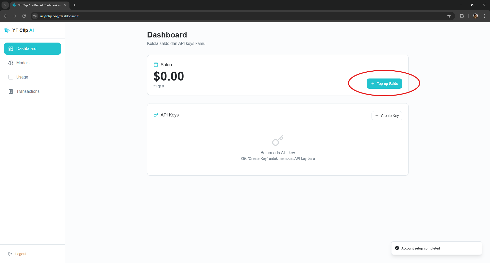

2. Masukkan jumlah top up yang diinginkan (dalam USD), akan terlihat konversi ke IDR

   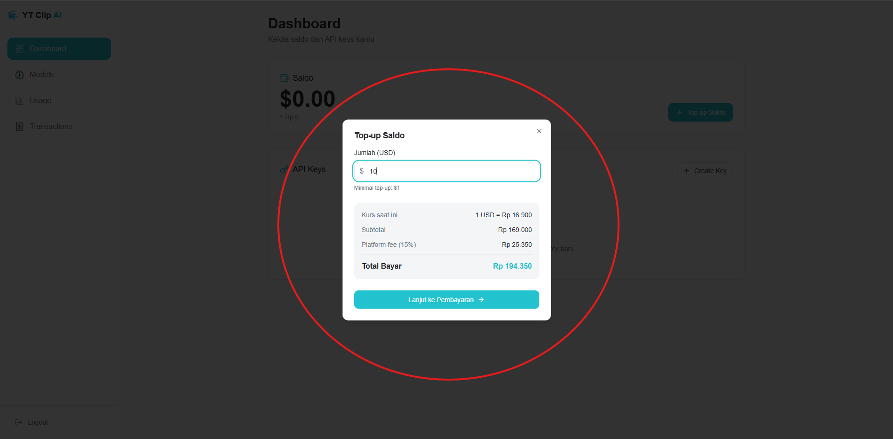

3. Bayar menggunakan **QRIS**

   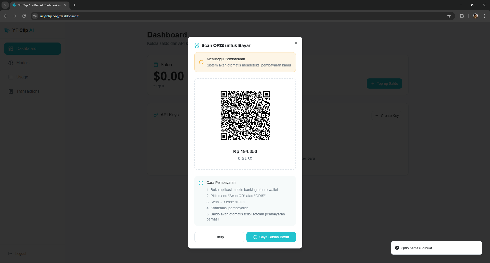

4. Setelah pembayaran berhasil, saldo USD akan langsung masuk secara realtime

### 4.3 Buat API Key

1. Setelah saldo terisi, klik tombol **"Create Key"**

   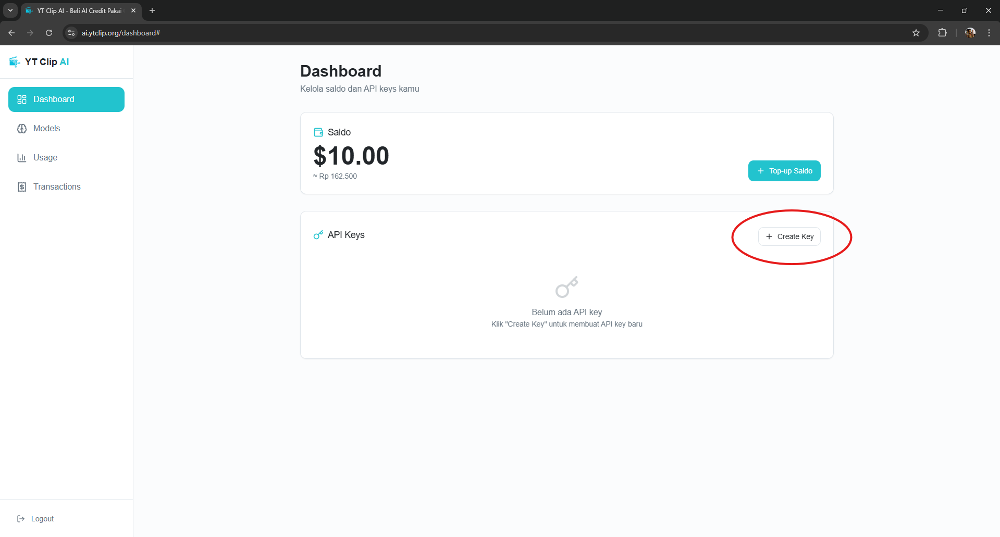

2. Isi nama untuk API Key kamu, lalu klik **"Create"**

   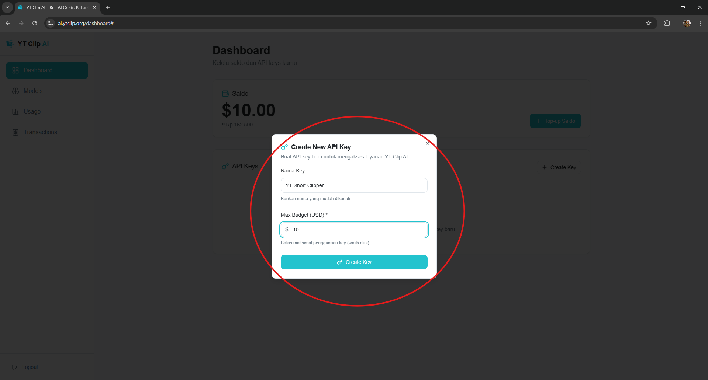

3. **Copy Secret Key** yang muncul dan simpan di tempat aman

   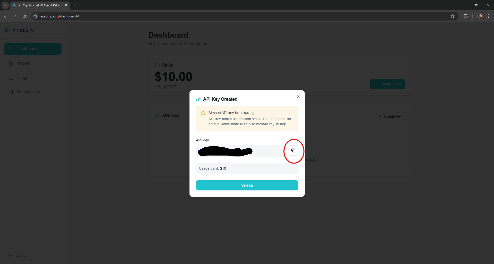

> **⚠️ Penting:** Secret Key hanya ditampilkan sekali! Pastikan sudah di-copy sebelum menutup dialog.

Setelah mendapatkan API Key, lanjut ke [Konfigurasi AI API](#5-konfigurasi-ai-api) untuk memasukkan key ke aplikasi.

---

## 5. Konfigurasi AI API

Aplikasi membutuhkan API Key untuk mengakses layanan AI (GPT, Whisper, TTS).

### 5.1 Buka AI API Settings

1. Klik tombol **Settings** (⚙️) di pojok kanan atas
2. Pilih menu **"AI API Settings"**

   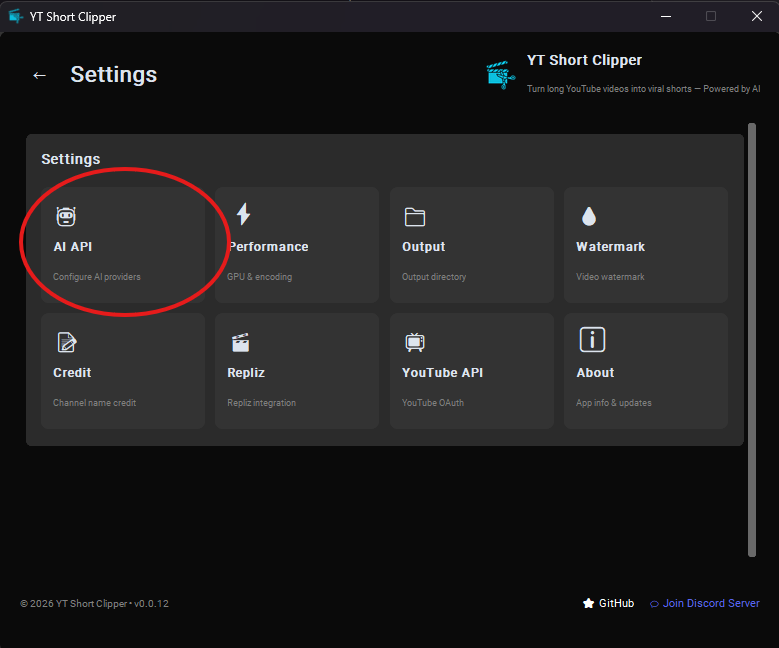

### 5.2 Pilih Modul AI

Aplikasi memiliki beberapa modul AI yang bisa dikonfigurasi secara terpisah:

   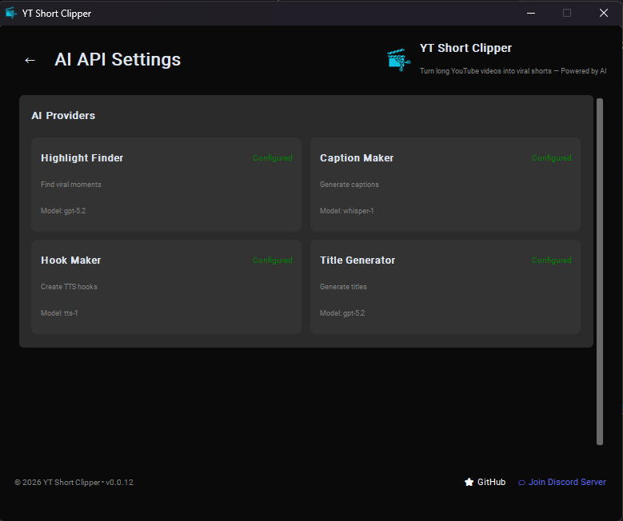

- **Highlight Finder** - Mencari momen menarik dari video
- **Caption Maker** - Membuat caption/subtitle
- **Hook Maker** - Membuat hook text untuk intro
- **Title Generator** - Generate judul & deskripsi SEO

### 5.3 Pilih AI Provider

1. Klik dropdown **"AI Provider"**
2. Pilih provider yang kamu punya API key-nya:
   - **YT CLIP AI** - [https://ai.ytclip.org](https://ai.ytclip.org)
   - **OpenAI** - [https://platform.openai.com](https://platform.openai.com)
   - **Custom** - Pakai provider lain

   

3. URL akan otomatis terisi sesuai provider yang dipilih

### 5.4 Masukkan API Key & Load Models

1. Paste **API Key** kamu di field yang tersedia
2. Klik tombol **"Load Models"** untuk mengambil daftar model

   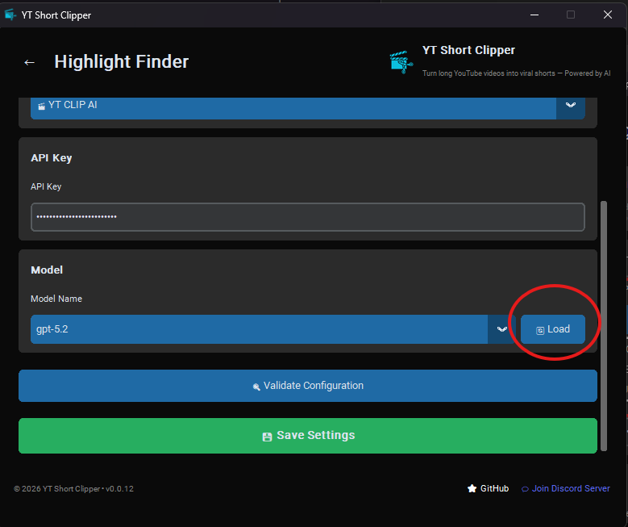

3. Pilih model yang ingin digunakan dari dropdown

   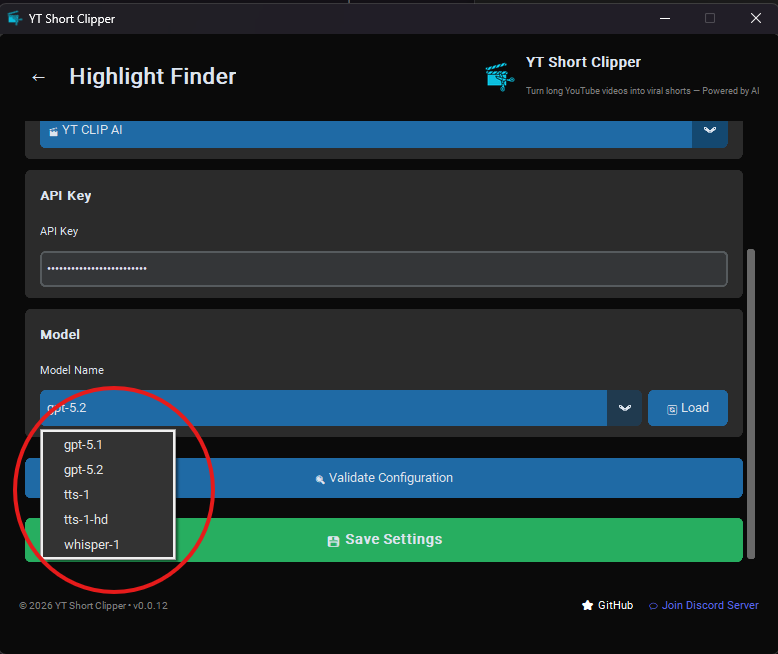

### 5.5 Validasi & Simpan

1. Klik tombol **"Validate"** untuk memastikan konfigurasi benar
2. Jika valid, klik **"Save"** untuk menyimpan

   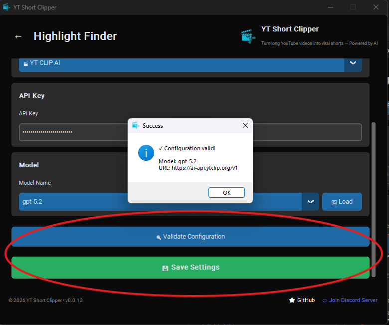

> **💡 Tips:** Ulangi langkah 5.2 - 5.5 untuk setiap modul AI yang ingin dikonfigurasi.

---

## 6. Mulai Menggunakan Aplikasi

Setelah semua setup selesai, kamu bisa mulai menggunakan aplikasi:

1. **Paste URL YouTube** yang ingin diproses
2. **Atur jumlah clips** yang diinginkan
3. **Klik "Start Processing"** dan tunggu hasilnya

Hasil clips akan tersimpan di folder `output/` dalam folder aplikasi.

---

## ❓ Butuh Bantuan?

- 🔑 [Dapatkan API Key AI di sini](https://ai.ytclip.org)
- 💬 Gabung [Discord Community](https://s.id/ytsdiscord) untuk tanya jawab, laporan bug, dan diskusi dengan pengguna lain
